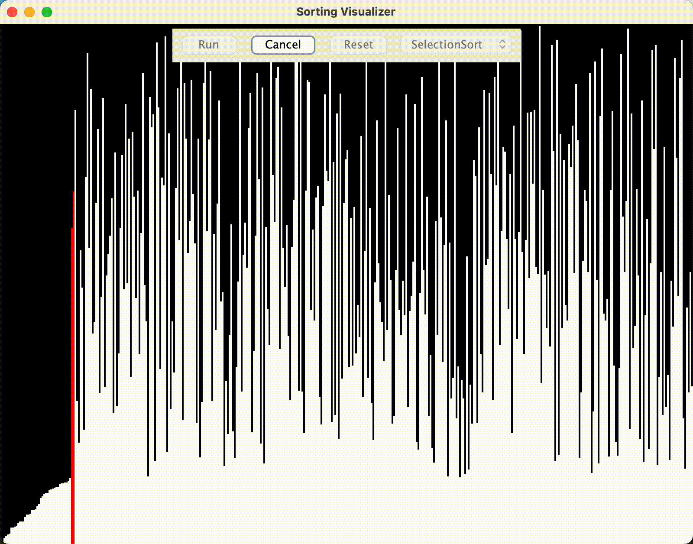
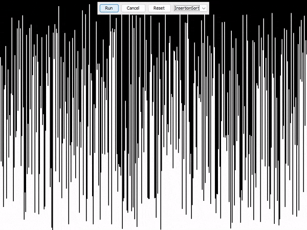
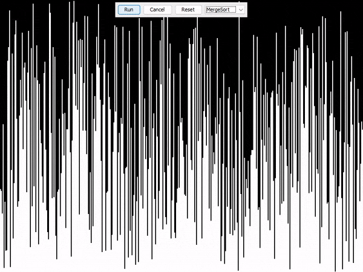
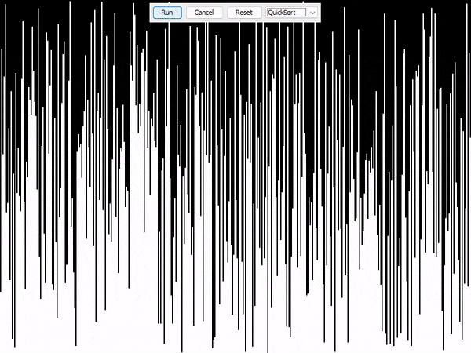

# Sorting Visualizer

## Overview
Sorting Visualizer is a Java-based application designed to visually demonstrate how different sorting algorithms work. It allows users to see the real-time sorting process, understand the mechanics behind each algorithm, and compare their performance.

## Features
- Visual representation of sorting algorithms in real-time.
- Supports multiple sorting algorithms, including but not limited to Bubble Sort, Quick Sort, Merge Sort, and Insertion Sort.
- Interactive GUI for easy manipulation and observation.

## Technology Stack
- **Java**: Core programming language used for application development.
- **Maven**: Utilized for automating build processes and managing dependencies.
- **Any IDE** or **Text Editor**: The project can be developed and configured using any IDE or text editor, though examples are provided for command line operations for simplicity.

## Setup Instructions
1. **Prerequisites**:
   - Ensure Java Development Kit (JDK) is installed on your system.
   - Maven should be installed for building and managing the project's dependencies.

2. **Clone or download the project**:
   - Obtain the project files by cloning this repository or downloading the provided ZIP file.

3. **Building the Project with Maven**:
   - Navigate to the project root directory in the terminal.
   - Run `mvn clean install` to build the project and install the artifact into your local repository.

4. **Running the Application**:
   - After building, execute `mvn exec:java` to run the application directly via Maven.
   - Alternatively, you can run the generated JAR file manually. Find the JAR in the `target` directory and run it using `java -jar target/Sorting-Visualizer-1.0-SNAPSHOT.jar` (adjust the JAR file name as necessary based on the version defined in your `pom.xml`).

## Usage
- Once the application is running, select an algorithm from the available list.
- Initiate the sorting process to see the algorithm in action.
- Observe the sorting in real-time and compare the performance metrics displayed.

## Contributing
Contributions to the Sorting Visualizer are welcome. Please feel free to fork the project, make your changes, and submit a pull request for review.

## License
Sorting Visualizer is released under the MIT License. See the [LICENSE](LICENSE) file for more details.

# Implemented Algorithms
- Bubble Sort
- Selection Sort
- Insertion Sort
- Merge Sort
- Quick Sort

# Bubble Sort

# Selection Sort

# Insertion Sort

# Merge Sort

# Quick Sort

