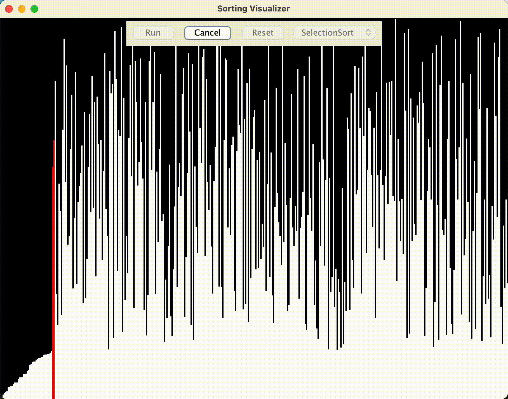
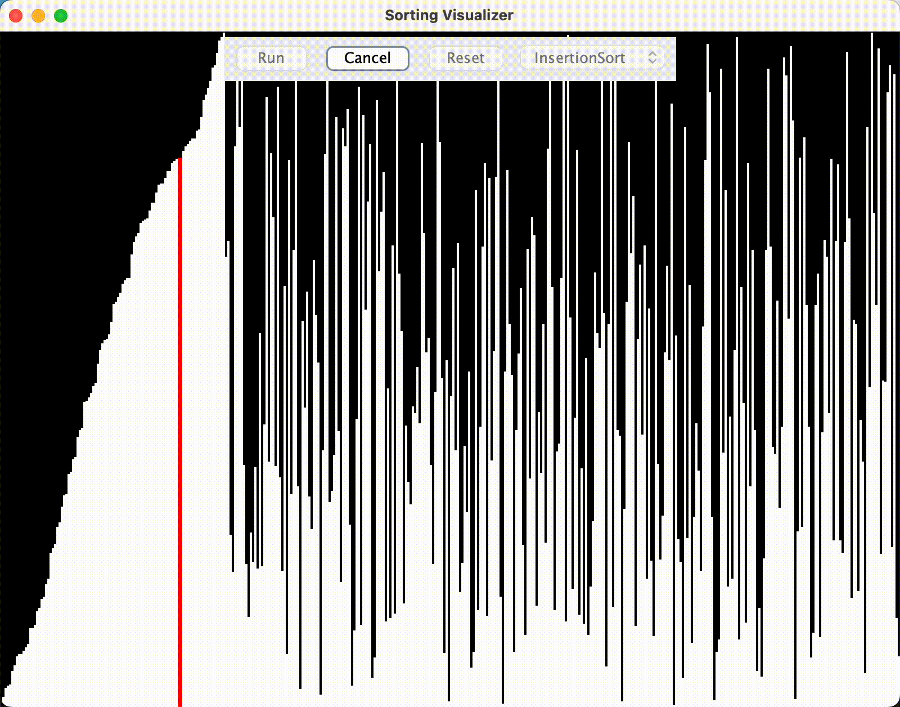
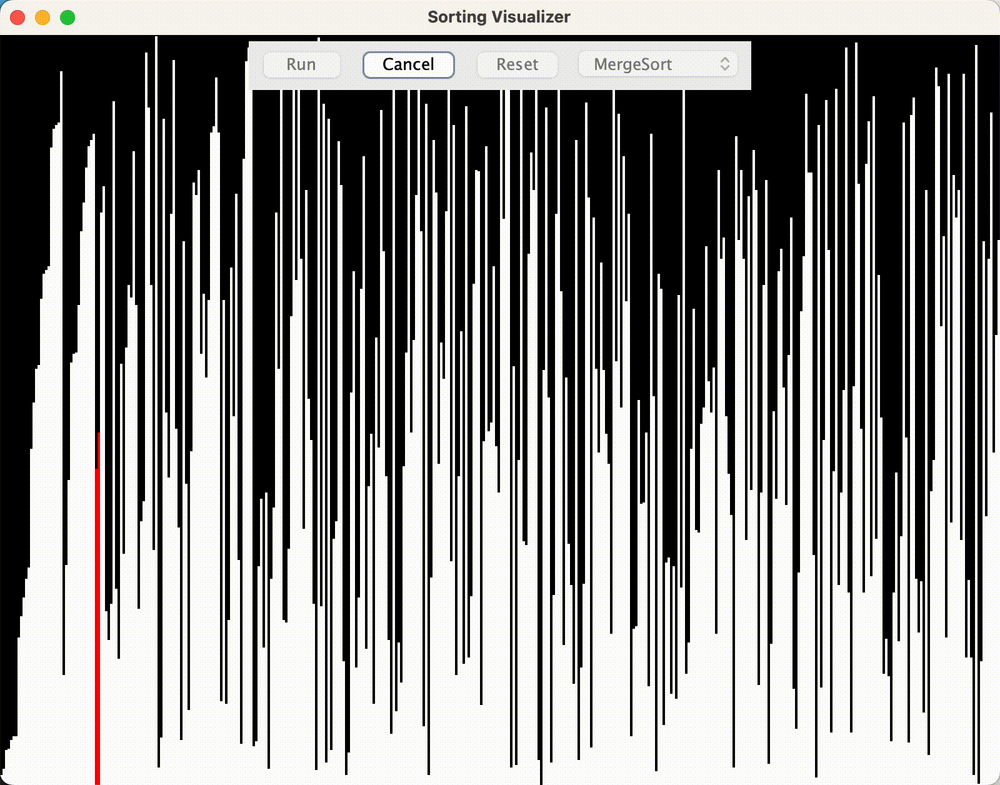
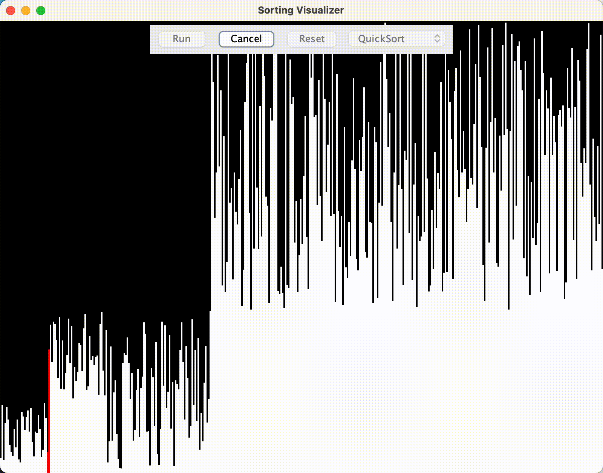

# Sorting Visualizer

## Overview
Sorting Visualizer is a Java-based application designed to visually demonstrate how different sorting algorithms work. It allows users to see the real-time sorting process, understand the mechanics behind each algorithm, and compare their performance.

## Features
- Visual representation of sorting algorithms in real-time.
- Supports multiple sorting algorithms, including but not limited to Bubble Sort, Quick Sort, Merge Sort, and Insertion Sort.
- Interactive GUI for easy manipulation and observation.

## Technology Stack
- **Java**: Core programming language used for application development.
- **Apache Ant**: Utilized for automating build processes.
- **NetBeans IDE**: The project is developed and configured via NetBeans IDE, facilitating code development and management.

## Setup Instructions
1. **Prerequisites**:
   - Ensure Java Development Kit (JDK) is installed on your system.
   - Apache Ant should be installed for building the project (optional if using NetBeans IDE directly).

2. **Clone or download the project**:
   - Obtain the project files by cloning this repository or downloading the provided ZIP file.

3. **Open the project in NetBeans IDE**:
   - Launch NetBeans IDE and open the project by navigating to `File` > `Open Project`, and select the `SortingVisualizer` directory.

4. **Build the project**:
   - In NetBeans, right-click on the project name in the Projects window and select `Build` (or `Clean and Build` if you prefer).

5. **Run the application**:
   - After building, right-click on the project name and select `Run` to launch the Sorting Visualizer.

Alternatively, if you prefer using the command line with Apache Ant:
- Navigate to the project root directory in the terminal.
- Run `ant build` to compile the project.
- Execute `ant run` to start the application (ensure your `build.xml` is configured to support this command).

## Usage
- Once the application is running, select an algorithm from the available list.
- Initiate the sorting process to see the algorithm in action.
- Observe the sorting in real-time and compare the performance metrics displayed.

## Contributing
Contributions to the Sorting Visualizer are welcome. Please feel free to fork the project, make your changes, and submit a pull request for review.

## License
Quant Market Predictor is released under the MIT License. See the [LICENSE](LICENSE) file for more details.

# Implemented Algorithms
- Bubble Sort
- Selection Sort
- Insertion Sort
- Merge Sort
- Quick Sort

# Bubble Sort

# Selection Sort

# Insertion Sort

# Merge Sort

# Quick Sort

