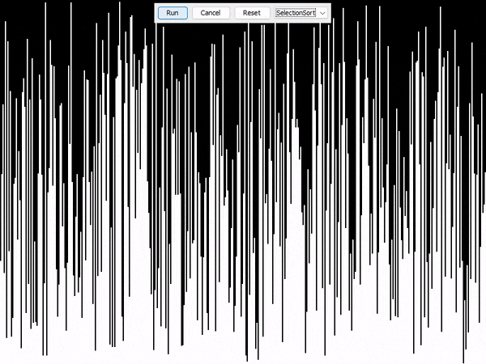

# 🔢 Sorting Visualizer

## 📌 Overview
**Sorting Visualizer** is a Java-based GUI application that visually demonstrates how various sorting algorithms work. It provides an interactive way to learn, observe, and compare different sorting strategies in real-time.

---

## ✨ Features
- 🎞️ Real-time visualization of sorting algorithms.
- 🧠 Understand algorithm behavior step by step.
- 📊 Compare performance of multiple algorithms.
- 🖱️ Interactive GUI – intuitive and easy to use.

---

## 🛠️ Tech Stack
- **Java** – Primary programming language.
- **Maven** – Build automation and dependency management.
- **Swing/AWT** – For graphical interface.
- **Any IDE** – IntelliJ, Eclipse, or just your favorite text editor.

---

## 🚀 Setup Instructions

### 1. ✅ Prerequisites
Make sure you have the following installed:

- Java JDK (version 8 or later)  
  ```bash
  java -version
  ```
- Maven  
  ```bash
  mvn -version
  ```

> If not installed, download [Java JDK](https://adoptopenjdk.net/) and [Maven](https://maven.apache.org/install.html).

---

### 2. 📁 Clone the Repository
```bash
git clone https://github.com/your-username/sorting-visualizer.git
cd sorting-visualizer
```
> Or download the ZIP and extract it.

---

### 3. ⚙️ Build the Project with Maven
```bash
mvn clean install
```

---

### 4. ▶️ Run the Application

#### Option A: Using Maven directly
```bash
mvn exec:java
```

#### Option B: Run the JAR manually
```bash
java -jar target/Sorting-Visualizer-1.0-SNAPSHOT.jar
```
> Make sure the version in the filename matches the version in your `pom.xml`.

---

## 🧪 Usage
1. Launch the application.
2. Select a sorting algorithm (e.g., Bubble Sort, Quick Sort).
3. Click "Start" to begin visualizing the sorting process.
4. Watch as elements are compared and swapped in real time.

---

## 🤝 Contributing
Pull requests are welcome!  
To contribute:
```bash
# Fork the repo
# Make changes
# Push to your branch
# Open a PR
```

---

## 📄 License
This project is licensed under the [MIT License](LICENSE).

---

## 📚 Implemented Algorithms
- ✅ Bubble Sort
- ✅ Selection Sort
- ✅ Insertion Sort
- ✅ Merge Sort
- ✅ Quick Sort

---

## 🖼️ Demo Visuals

### 🔁 Bubble Sort


### 🎯 Selection Sort


### ✍️ Insertion Sort


### 🧩 Merge Sort


### ⚡ Quick Sort

